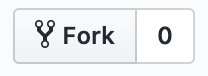
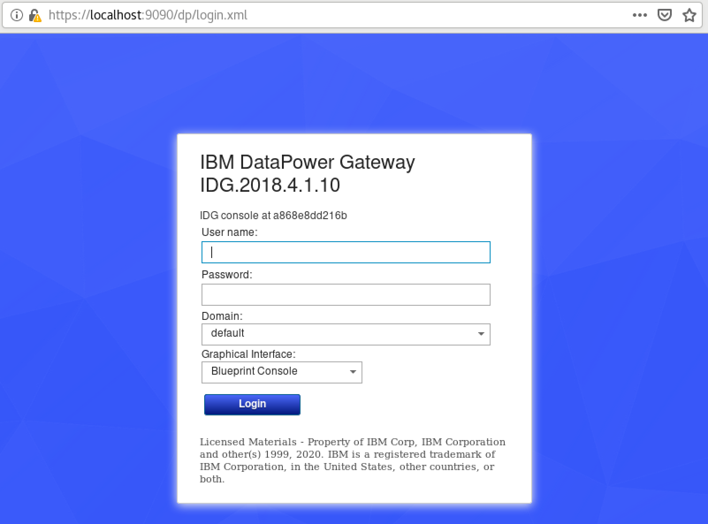
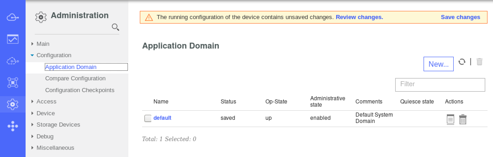
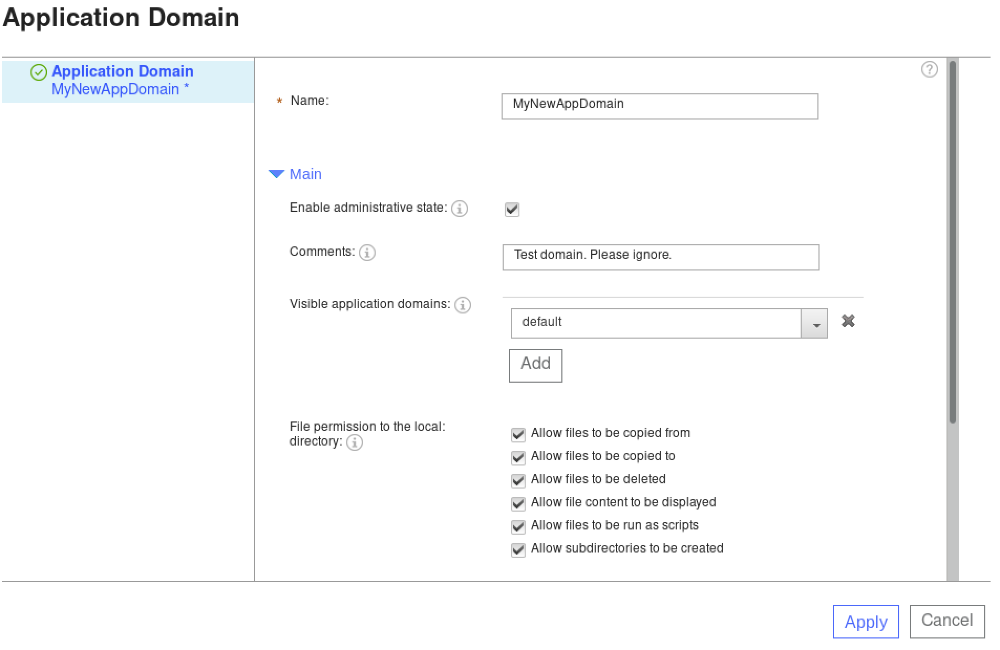
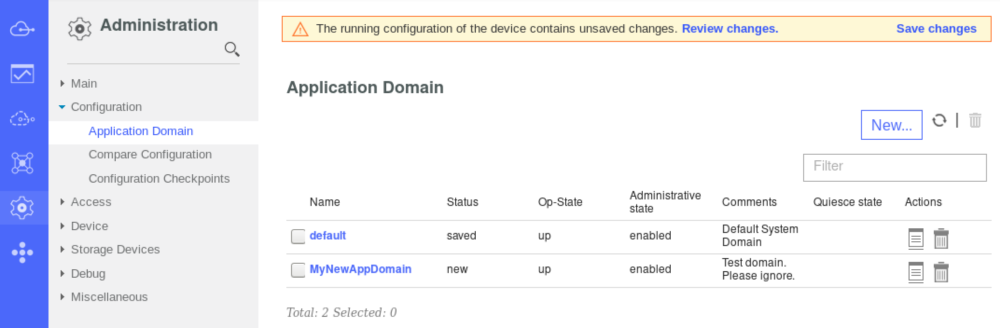
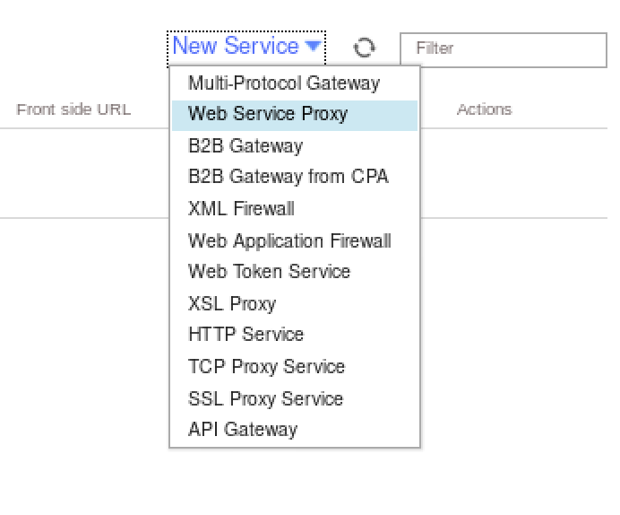
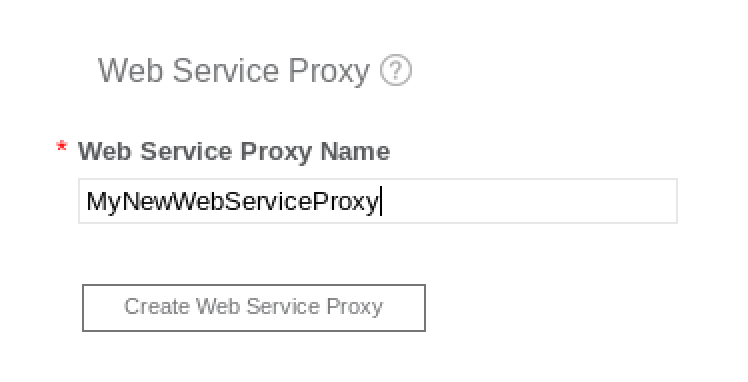
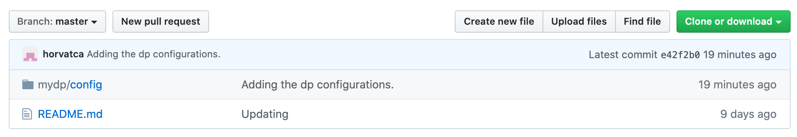
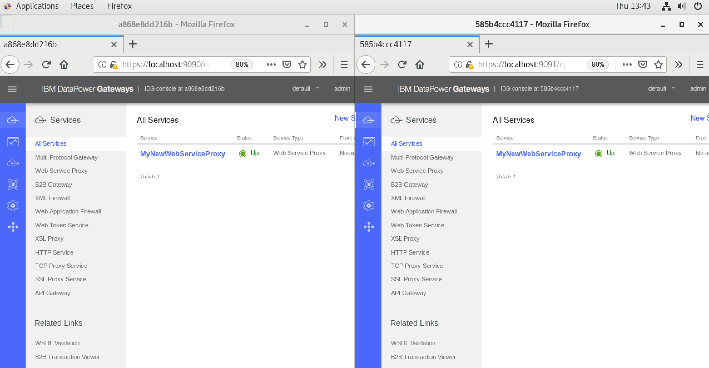
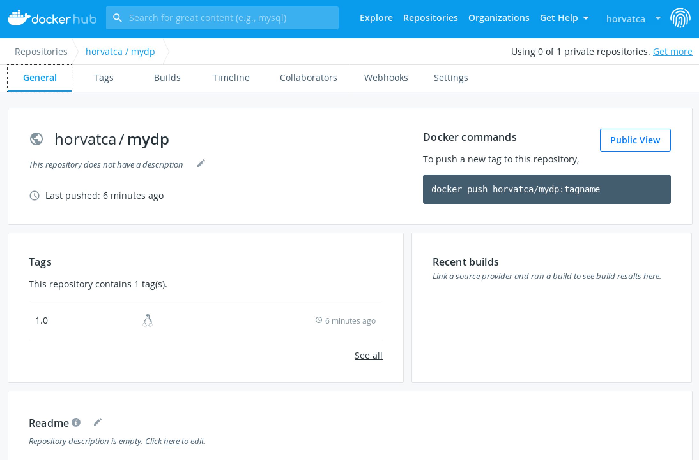

# An Introduction to DataPower with Docker

This lab will introduce you to the basics of working with DataPower using Docker containers. You will learn how to launch and configure DataPower containers, create your own custom DataPower container image, and put all the important assets in change control. You will also publish your final DataPower container image to a repository, where it can be used by other team members or devops pipelines.

The lab focuses on how the tools fit together. It is not an in depth course on any of the tools specifically. You will use the DataPower container, Docker, Docker Hub, and Git.  The concepts here apply to just about ANY container, not just DataPower.

This lab is perfect for you if:
* You are just starting out with DataPower.
* You are a current DataPower customer who want to move to using a containerized DataPower deployment.
* You are a manager who wants to better understand the tools your team is using.
* You want to know the basics about how software is deployed with containers.
* You want to know how the most popular open source tools for containers and version control work together.

### Author contact
Contact me at chase.horvath@ibm.com with comments and questions.

# Prerequisites
### Knowledge
You should have a basic knowledge of how to access and work in the Linux command line terminal. All the commands you will need are provided. You really just need to know that it exists and know how to open it.

### The lab environment
It is best to use an environment hosted by IBM as it will be set up specifically with the prerequisites for the lab. You can request one from the author, chase.horvath@ibm.com. It will be accessible via a web browser.  
If you wish to build your own environment, Appendix A: Set up your own VM, is at the end of this lab and has instructions to help you.

### Accounts you will need (all free)
* A GitHub account. (https://github.com/)
* A Docker Hub account. (https://hub.docker.com/)

# Access your VM
If you are using a VM provided by the author or IBM, you will receive and email with access instructions. The user name for the supplied VM is "ibmuser" and the super secret password is "ibmuser".  
If you are using your own VM, then log in, bring up your desktop, and open a terminal window.

# Gitting started with Git
Git is a distributed version-control system for tracking changes in source code during software development. It is designed for coordinating work among programmers, but it can be used to track changes in any set of files. For example, this lab is hosted on Git Hub, which is a website that hosts Git.

If you have not logged into the VM yet, log in. User = ibmuser Password = ibmuser

Open up a new terminal window and verify that Git is installed with the following command:
````console
git --version
````
You console output will look something like the following to show what version is installed.
````console
[ibmuser@localhost mydp]$ git --version
git version 1.8.3.1
````

Open a browser and log into your GitHub account. Navigate to the repository that this lab is in: https://github.com/horvatca/IntroToDataPowerOnDockerLab.

Fork the repository. The Fork button can be found in the top right of the page when viewing the repository. 



This will give you your own copy to work with in your own GitHub account and make setting up the lab environment easier. Navigate to the repository in YOUR account.

Next, download YOUR repository to YOUR local home directory. You will use the git clone command and the link to your repository. The below commands move you to your home directory and download, or "clone", the repository. 
The link you will substitute into the git clone command can be found in the green "Clone or download" button when viewing YOUR repository in YOUR account in the browser. 


````console
cd ~
git clone https://github.com/[YOUR ACCOUNT NAME HERE]/IntroToDataPowerOnDockerLab.git
````

Now the repository is set up on your local computer! We will use it a lot later.

# Docker Setup
Docker is the container runtime you will use for the DataPower container in this lab.

### Verify Docker installation.
In you terminal, verify that Docker is installed with the following command:
````console
docker -v
````
You console output will look something like the following to show what version is installed.
````console
[ibmuser@localhost mydp]$ docker -v
Docker version 19.03.8, build afacb8b
````

### Run your first Docker container.

In you terminal, run the following command:
````console
docker run hello-world
````
You will see something like the following to show that it worked.
````console
[ibmuser@localhost mydp]$ docker run hello-world
Unable to find image 'hello-world:latest' locally
latest: Pulling from library/hello-world
0e03bdcc26d7: Pull complete 
Digest: sha256:6a65f928fb91fcfbc963f7aa6d57c8eeb426ad9a20c7ee045538ef34847f44f1
Status: Downloaded newer image for hello-world:latest

Hello from Docker!
This message shows that your installation appears to be working correctly.

To generate this message, Docker took the following steps:
 1. The Docker client contacted the Docker daemon.
 2. The Docker daemon pulled the "hello-world" image from the Docker Hub.
    (amd64)
 3. The Docker daemon created a new container from that image which runs the
    executable that produces the output you are currently reading.
 4. The Docker daemon streamed that output to the Docker client, which sent it
    to your terminal.

To try something more ambitious, you can run an Ubuntu container with:
 $ docker run -it ubuntu bash

Share images, automate workflows, and more with a free Docker ID:
 https://hub.docker.com/

For more examples and ideas, visit:
 https://docs.docker.com/get-started/
````

Great! Docker is working!


# Starting a DataPower container
You now want to run your first DataPower container. Docker makes this super easy. You can do it with a single command.

First, make a directory to work in. Do this inside of your local repository. Open up it's permissions so that our DataPower can write to it later, then enter it.
````console
mkdir ~/IntroToDataPowerOnDockerLab/mydp
cd ~/IntroToDataPowerOnDockerLab/mydp
````

Second, start a DataPower container. In you terminal, run the following command:
````console
docker run -it \
  -v $PWD/config:/drouter/config \
  -v $PWD/local:/drouter/local \
  -e DATAPOWER_ACCEPT_LICENSE=true \
  -e DATAPOWER_INTERACTIVE=true \
  -e DATAPOWER_WORKER_THREADS=4 \
  -p 9090:9090 \
  ibmcom/datapower:2018.4.1
````
You will see something like the following to show what version is installed.
````console
Unable to find image 'ibmcom/datapower:2018.4.1' locally
2018.4.1: Pulling from ibmcom/datapower
acb220039030: Pull complete 
... ... ... a bunch of logs that arent important right now ... ... ...
20200511T192821.747Z [0x8100003b][mgmt][notice] domain(default): Domain configured successfully.
20200511T192822.372Z [0x00350014][mgmt][notice] quota-enforcement-server(QuotaEnforcementServer): tid(799): Operational state up
login: 
````

What did that command do?  
You just provisioned a DataPower with a single command! Wasn't that cool? Way easier and faster than other methods? I think so!  
You asked Docker to run a DataPower container and it did! Let's break down the command line by line:


docker run -it    **-This tells docker to run the container with a bash shell (terminal) attached to it.**  
-v $PWD/config:/drouter/config     **-This binds a volume inside the container to a volume on your local OS. More on this later in the lab.**  
-v $PWD/local:/drouter/local     **-This binds a volume inside the container to a volume on your local OS. More on this later in the lab.**  
-e DATAPOWER_ACCEPT_LICENSE=true     **-This sets an environent varialbe for the container to a specific value. In this case, it accepts the license agreement.**  
-e DATAPOWER_INTERACTIVE=true      **-This sets an environent varialbe for the container to a specific value. In this case, it allows acess to the container via the command line after it is started.**   
-e DATAPOWER_WORKER_THREADS=4     **-This sets an environent varialbe for the container to a specific value. In this case, it sets the number of worker threads to 4.**  
-p 9090:9090      **-This maps port 9090 of the container to port 9090 of your host OS.**  
ibmcom/datapower:2018.4.1     **-This specifies that we want to run the container named "datapower" from the "/ibmcom" repository. Specifically the "2018.4.1" version.**  


>Note: Notice that docker downloaded the container image. If looks to see if you have the image locally first, then downloads if it is not present. Once it has the image, it creates a container based on the image. That image can be used over and over again to create containers. Think of it like a template.


### Using your new DataPower container  
DataPower is running and now you want to configure it to do something! This lab is not meant to teach DataPower configurations, so we will keep it simple. We will log in, make some basic configurations, and then export the configuration.

In you terminal, log into the running DataPower. The login prompt should be present already since you started the container. The super secret default user is "admin" and the super secret default password is.... "admin".
````console
login: admin
Password: *****
````
The output should be similar to the following:
````console
Welcome to IBM DataPower Gateway console configuration. 
Copyright IBM Corporation 1999, 2020 

Version: IDG.2018.4.1.10 build 318002 on Feb 21, 2020 11:09:49 AM
Delivery type: LTS
Serial number: 0000001

idg# 
````

The first thing you probably want to do if you are doing DP dev work is enable the Web GUI.
In you terminal, run the following command:
````console
configure; web-mgmt 0 9090 9090;
````
The output should be similar to the following:
````console
Global mode
Web management: successfully started
````
>Note: Remember in the docker run command when we mapped the container's port 9090 to the host's port 9090? Well, we just started the web GUI on the container's port 9090, so now we should be able to access it from our host's port 9090.

Open up a web browser and browser to https://localhost:9090.
You should see the DataPower login screen. You may have to accept an insecure certificate to get there using the browsers settings. Firefox makes it easy.




# Make and save some configurations  
Now that we have access to the GUI, we can make some configurations. Then we will export them so that we can build them into a container image and rapidly launch LOTS of DataPower containers with those configurations.

If you aren't already there, open up a web browser and browser to https://localhost:9090. Then, login with the un/p of admin/admin again. Leave the other settings alone. 

Now that you are logged in, you can see that there is nothing configured in this DP. That is because it was made from the bare DP image. Let's make a few simple configurations.


### Create a new domain  
In the left most menu, click on the Admin gear, then click the Configuration drop down arrow, then select Application Domain. Your screen will look like the below image.



Click the New... button. Give your domain the name "MyNewAppDomain" and a comment like in the below image. Then click Apply.



You will be taken to the Application Domains list and yours will appear like in the below image.




### Create a new Web Service Proxy  
Click the blue cloud icon in the top of the left bar menu then click the New Service drop down in the upper right. Select Web Service Proxy.



In the Web Service Proxy Name field, enter "MyNewWebServiceProxy" and click the Create Web Service Proxy button.  



That is all you need to do. You can click the All Services link to return to the previous screen where you will see your MyNewWebServiceProxy listed.

### Save the configurations  

**OPEN A NEW TERMINAL WINDOW** Leave the other one open.  
Open up the permissions on the location where DP will save the configurations.
````console
sudo chmod 777 -R ~/IntroToDataPowerOnDockerLab/mydp
````

Return to the browser with the DP GUI. Across the top of the DP interface in the browser has been a message bar saying "The running configuration of the device contains unsaved changes." Click the Save Changes link in that message bar.


### Explore the configuration files  
The changes you just made to the running DataPower (made a Web Service Proxy and a new Application Domain) were persisted in configuration files. Remember the  "-v $PWD/config:/drouter/config" and "-v $PWD/local:/drouter/local" parts of the command that we used to start the container? Those mapped where the configuration files were saved to our local host file system. Let's explore them with the following commands.

````console
tree ~/IntroToDataPowerOnDockerLab/mydp
````
What you see are two directories inside the mydp directory where you started the container from. config and local were created by the container to persist the settings. Your output should look like the below:

````console
[ibmuser@localhost secondDP]$ tree ~/IntroToDataPowerOnDockerLab/mydp
/home/ibmuser/IntroToDataPowerOnDockerLab/mydp
├── config
│   ├── auto-startup.cfg
│   └── auto-user.cfg
└── local

2 directories, 2 files
````

Now move into the config directory and take a look at the .cfg files in it. You will search the auto-startup.cfg file for the text "My" so that we will be shown the exact lines that reference the "MyNewWebServiceProxy" and "MyNewAppDomain" we created.

````console
cd  ~/IntroToDataPowerOnDockerLab/mydp/config
sudo grep .*My.* auto-startup.cfg 
````
You'll see something like the below. LOOK! YOUR STUFF!
````console
[ibmuser@localhost IntroToDataPowerOnDockerLab]$ cd  ~/IntroToDataPowerOnDockerLab/mydp/config
[ibmuser@localhost config]$ sudo grep .*My.* auto-startup.cfg 
[sudo] password for ibmuser: 
action "MyNewWebServiceProxy_default_request-rule_defaultaction_result"
action "MyNewWebServiceProxy_default_request-rule_defaultaction_slm"
  slm "MyNewWebServiceProxy"
action "MyNewWebServiceProxy_default_response-rule_defaultaction_result"
matching "MyNewWebServiceProxy_match_all"
wsm-rule "MyNewWebServiceProxy_default_request-rule"
  action MyNewWebServiceProxy_default_request-rule_defaultaction_slm
  action MyNewWebServiceProxy_default_request-rule_defaultaction_result
wsm-rule "MyNewWebServiceProxy_default_response-rule"
  action MyNewWebServiceProxy_default_response-rule_defaultaction_result
wsm-endpointrewrite "MyNewWebServiceProxy"
wsm-stylepolicy "MyNewWebServiceProxy"
  match "fragmentid" "" "MyNewWebServiceProxy_match_all" "MyNewWebServiceProxy_default_request-rule" "" "http://www.datapower.com/fragment-id#dp.all()"
  match "fragmentid" "" "MyNewWebServiceProxy_match_all" "MyNewWebServiceProxy_default_response-rule" "" "http://www.datapower.com/fragment-id#dp.all()"
wsgw "MyNewWebServiceProxy"
  endpoint-rewrite-policy MyNewWebServiceProxy
  stylepolicy MyNewWebServiceProxy
slm-policy "MyNewWebServiceProxy"
domain "MyNewAppDomain"
````

> Note: You can also check out the entire text if you want, but it's long. The command is "sudo cat auto-startup.cfg"

For the changes we made, this auto-startup.cfg file is the only place they will show up. More complicated configurations will have more files in both the config and local directories.

# Put your configurations in source control using Git

We want to be able to use these configurations over and over, see what changes from version to version, and share them with team members, and work on them with team members. The best place do that is in a Git repository. We will "push" these files to our git repo now.

>Note: Most GitHub repositories, like the ones we are using, are public. Anybody can see it. In a real scenario, you would have your own private repository that allowed you to control access. 

# TODO: 
  May have to stop the container. During testing, try with it running. I wrote the below with it stopped.
[ibmuser@localhost IntroToDataPowerOnDockerLab]$ docker ps
CONTAINER ID        IMAGE                       COMMAND             CREATED             STATUS              PORTS                    NAMES
a868e8dd216b        ibmcom/datapower:2018.4.1   "/start.sh"         9 days ago          Up 9 days           0.0.0.0:9090->9090/tcp   mystifying_wright
[ibmuser@localhost IntroToDataPowerOnDockerLab]$ docker stop a868e8dd216b
a868e8dd216b  
END TODO

Use the below commands to push your configuration file to your GitHub repository.

````console
cd ~/IntroToDataPowerOnDockerLab
git add .
git commit -m 'Adding the dp configurations.'
git push
````

Next, browse to your repository in the browser. You should see that in addition to the README.md, your configs are also there! It should look like the below screen shot. You may need to refresh the page if you were already there:



> Note: If you explore the files that got pushed to GitHub, you will notice that the /IntroToDataPowerOnDockerLab/mydp/local directory was no pushed. This is because the directory is empty and by default, Git will ignore it. This is OK. It will not interfere with our lab.

WONDERFUL! You now have the configurations you made to DataPower stored in version control! In the next parts of the lab, we will use them to create and deploy more DataPowers containers with the same configurations.

# Launch another DataPower with the configurations
This will show you a basic way to launch another DataPower with the same configurations as the one you just built. It is important to understand how this works so that you can package the configurations into a container image so that you can distribute the image for use by your teams.

### Stage the configuration files

OPEN AN NEW TERMINAL WINDOW and use the commands below to create a new directory and clone your configuration files from the Git repository you just pushed them to. In the git clone command below, replace the [YOUR ACCOUNT NAME HERE] with your GitHub account name. You can also get the entire link from the handy green button on your repository home page like at the very beginning of the lab.

>Note: You could have just copied them, but cloning them gets you more familiar with Git. Also, anybody who has access to this repo could get the files in the same way.

````console
mkdir ~/secondDP
cd ~/secondDP
git clone https://github.com/[YOUR ACCOUNT NAME HERE]/IntroToDataPowerOnDockerLab.git
````

You will see it download with output like the below:
````console
[ibmuser@localhost secondDP]$ git clone https://github.com/horvatca/IntroToDataPowerOnDockerLab.git
Cloning into 'IntroToDataPowerOnDockerLab'...
remote: Enumerating objects: 15, done.
remote: Counting objects: 100% (15/15), done.
remote: Compressing objects: 100% (11/11), done.
remote: Total 15 (delta 0), reused 12 (delta 0), pack-reused 0
Unpacking objects: 100% (15/15), done.
````

Optional:
If you have tree installed, you can check what was downloaded easily. See an example below.
```console
[ibmuser@localhost ~]$ tree ~/secondDP/
/home/ibmuser/secondDP/
└── IntroToDataPowerOnDockerLab
    ├── mydp
    │   └── config
    │       ├── auto-startup.cfg
    │       └── auto-user.cfg
    └── README.md

3 directories, 3 files

````

### Launch and inspect the new DataPower container

With the commands below, you will move to the directory where the newly downloaded config files are and then start a DataPower container. The only difference in the docker run command compared to what you used before is you are now mapping the containers port 9090 to the host's port 9091.

````console
cd ~/secondDP/IntroToDataPowerOnDockerLab/mydp/
docker run -it \
  -v $PWD/config:/drouter/config \
  -v $PWD/local:/drouter/local \
  -e DATAPOWER_ACCEPT_LICENSE=true \
  -e DATAPOWER_INTERACTIVE=true \
  -e DATAPOWER_WORKER_THREADS=4 \
  -p 9091:9090 \
  ibmcom/datapower:2018.4.1
````

Give it a minute to start, then browse to https://localhost:9091. Login with un/p = admin/admin as before. Magically, you see your MyNewWebServiceProxy and the MyNewAppDomain in this brand new container! You can browse to the other one at https://localhost:9090 and see them side by side like in the below screen shot.



>Note: Check out that odd string of numbers at the top of each browser window and in the DP GUI where it says IDG console at XXXXXXXXX. This is the ID of the container and we will see it in the next steps.

### Check to see what docker is running

We know that we have the two DPs running, but let's take a look at it from the Docker perspective.

OPEN A NEW TERMINAL WINDOW and execute the following command to see what containers are currently running.
````console
docker ps
````
Your output will show you the two running DataPowers and some other data like the below output.
````console
[ibmuser@localhost mydp]$ docker ps
CONTAINER ID        IMAGE                       COMMAND             CREATED             STATUS              PORTS                    NAMES
585b4ccc4117        ibmcom/datapower:2018.4.1   "/start.sh"         15 minutes ago      Up 15 minutes       0.0.0.0:9091->9090/tcp   boring_pike
a868e8dd216b        ibmcom/datapower:2018.4.1   "/start.sh"         9 days ago          Up 8 minutes        0.0.0.0:9090->9090/tcp   mystifying_wright

````
>Note: This is pretty cool. You can see a lot of metadata here including what ports are mapped and funny names Docker will apply to containers you don't specifically name (it's an option...). You can also infer that I wrote this lab over at least a 9 day span as one container was created 9 days ago and the other was created 15 minutes ago.

### Clean you work area
We are done with the DataPower containers we have running, so we can delete them to get them out of the way.  
The docker ps command told us the CONTAINER IDs of the containers you have running. We need to stop the containers, then remove them. Insert the CONTAINER ID in the commands below to stop and delete the container. Stop and delete all of the containers.

````console
docker stop [insert your docker container ID]
docker container rm [insert your docker container ID]
````

The commands and output will look like the following:
````console
[ibmuser@localhost mydp]$ docker stop 585b4ccc4117
585b4ccc4117
[ibmuser@localhost mydp]$ docker rm 585b4ccc4117
585b4ccc4117
[ibmuser@localhost mydp]$ docker stop a868e8dd216b
a868e8dd216b
[ibmuser@localhost mydp]$ docker rm a868e8dd216b
a868e8dd216b
````

You can now run the docker ps command again and the output will be blank. However docker ps only returns running containers. We want to see ALL the containers, running or stopped. Use the -a option to see them all and verify that you have sucessfully removed all the containers.

````console
docker ps -a
````

Your output will look like the following headers with no data!:
# UPDATE THIS TO SHOW THE HELLO WORLD CONTAINER AS WELL. 3 in total maybe??????
````console
[ibmuser@localhost mydp]$ docker ps -a
CONTAINER ID        IMAGE               COMMAND             CREATED             STATUS              PORTS               NAMES
````

#### WE AREN'T DONE CLEANING YET!

Remember that we have both docker IMAGES and CONTAINERS. Use the docker images -a command to see all the images you have locally. You output will look something like the below.

````console
[ibmuser@localhost mydp]$ docker images -a
REPOSITORY          TAG                 IMAGE ID            CREATED             SIZE
ibmcom/datapower    2018.4.1            4975fdceebe6        2 months ago        873MB
hello-world         latest              bf756fb1ae65        4 months ago        13.3kB
````

> Note: Why do you only see two images but you ran 3 containers? Remember that a container is made according to an image. The two DataPower containers you ran used the same image!

Remove the hello-world image with the docker rmi -f command. In the example below, insert YOUR hello-world IMAGE ID in the brackets.

````console
docker rmi -f [insert your docker container ID]
````

Your output will look similar to the following:  
````console
[ibmuser@localhost mydp]$ docker rmi -f bf756fb1ae65
Untagged: hello-world:latest
Untagged: hello-world@sha256:6a65f928fb91fcfbc963f7aa6d57c8eeb426ad9a20c7ee045538ef34847f44f1
Deleted: sha256:bf756fb1ae65adf866bd8c456593cd24beb6a0a061dedf42b26a993176745f6b
````

>Note: If you accidentally delete your DataPower image, that is OK. It will be automatically downloaded next time you want to use it... like coming up very soon in the next sections.

Now try browsing to your two DataPowers. POOF! GONE! They don't exist anymore.

You can close the old terminal windows where the DataPowers were running.

# Create a container image with your configurations

Next, we are going to build our own DataPower Docker image that includes the configurations you made. This is useful because it bundles everything together in one entity that can be put in change control and distributed. The person running it does not need to position any of the separate configuration files. It makes deployments simple, fast, repeatable, and controlled.

### Create the Dockerfile
A docker image is defined via a Dockerfile.

Make sure you are in the /home/ibmuser/secondDP/IntroToDataPowerOnDockerLab/mydp directory. This is where we are going to create the Dockerfile. Use the following command (copy and past all at once) to create the file:

````console
cd ~/secondDP/IntroToDataPowerOnDockerLab/mydp/
cat >> Dockerfile <<EOL
FROM ibmcom/datapower:2018.4.1

ENV  DATAPOWER_ACCEPT_LICENSE=true \
     DATAPOWER_INTERACTIVE=true \
     DATAPOWER_WORKER_THREADS=2 \

EXPOSE 9090

ADD ./config /drouter/config
ADD ./local /drouter/local
EOL
````

That just made a file called Dockerfile with the content shown above. Let's break it down line by line:  
FROM ibmcom/datapower:2018.4.1   **- start with the DataPower container versioned 2018.4.1**  
  
ENV  DATAPOWER_ACCEPT_LICENSE=true \  **- set these environment variables inside the container**  
     DATAPOWER_INTERACTIVE=true \  
     DATAPOWER_WORKER_THREADS=2 \  
  
EXPOSE 9090     **- make port 9090 accessible**  
  
ADD ./config /drouter/config     **- copy the contents from the config and local directories where this**  
ADD ./local /drouter/local        **-  image is being made INTO the corresponding locations INSIDE the container image.**  


### Build it
The docker build command will take the instructions from the Dockerfile and turn them into a container image.  
Execute the below docker build command, which uses the -t option to tag, or name, the image "mydp:1.0".
````console
docker build -t mydp:1.0 .
````
Your docker build console output will look like:
````console
[ibmuser@localhost mydp]$ docker build -t mydp:1.0 .
Sending build context to Docker daemon  28.67kB
Step 1/5 : FROM ibmcom/datapower:2018.4.1
 ---> 4975fdceebe6
Step 2/5 : ENV  DATAPOWER_ACCEPT_LICENSE=true      DATAPOWER_INTERACTIVE=true      DATAPOWER_WORKER_THREADS=2
 ---> Running in 80a5d6923b59
Removing intermediate container 80a5d6923b59
 ---> bec96addedca
Step 3/5 : EXPOSE 9090
 ---> Running in a38e9fb8dcdd
Removing intermediate container a38e9fb8dcdd
 ---> d9ea44327410
Step 4/5 : ADD ./config /drouter/config
 ---> 0596b68a47eb
Step 5/5 : ADD ./local /drouter/local
 ---> 7818f17dfd9d
Successfully built 7818f17dfd9d
Successfully tagged mydp:1.0
````

Now, check your local images with the docker images command and see your new image!
````console
docker images
````

Your docker images console output will look like:
````console
[ibmuser@localhost mydp]$ docker images
REPOSITORY          TAG                 IMAGE ID            CREATED             SIZE
mydp                1.0                 7818f17dfd9d        2 minutes ago       873MB
ibmcom/datapower    2018.4.1            4975fdceebe6        2 months ago        873MB
````


### Run it
Now we can run our new image. Because you built the config files and environment settings into the image, you don't have to specify them when you run it anymore! Everything is packaged, making deployments fast, controlled, simple, repeatable, and reliable.

````console
docker run -it -p 9090:9090 mydp:1.0
````

Your console output will look like:
````console
[ibmuser@localhost mydp]$ docker run -it -p 9090:9090 mydp:1.0
INFO[0000] Starting snmp exporter (version=0.11.0, branch=HEAD, revision=e4591716c29459cb2a12b1bed129af519ad91d23)  source="main.go:138"
INFO[0000] Build context (go=go1.10.2, user=root@80735d30559d, date=20180530-10:24:52)  source="main.go:139"
INFO[0000] Listening on :63512                           source="main.go:218"
20200529T174859.772Z [0x8040006b][system][notice] logging target(default-log): Logging started.
20200529T174900.175Z [0x804000fe][system][notice] : Container instance UUID: fdc072d5-05a4-4314-a256-bb30b4c8e0cd, Cores: 2, vCPUs: 2, CPU model: Intel(R) Core(TM) i7-6820HQ CPU @ 2.70GHz, Memory: 9628.9MB, Platform: docker, OS: dpos, Edition: developers-limited, Up time: 0 minutes
20200529T174900.211Z [0x8040001c][system][notice] : DataPower IDG is on-line.
..... A bunch of logs that may include a few arnings about gateway peering and which are OK to ignore for this lab.....
````

Great! let's see how we did. Open a browser and browse to https://localhost:9090.  
You should see the DataPower login page. It may take a few seconds depending on the resources of your machine, but in general, containers spin up very quickly. Login (un/p = admin/admin) and poke around just as we did before to verify that the settings we made are there.

Congratulations! You have just successfully created and launched your own custom DataPower container.

# Push your Dockerfile to your Git repository
You created a new asset - the Dockerfile - that you want to keep in Git for all the reasons we keep things in Git.  
Use the below sequence of commands to add that Dockerfile to your repo. This is just like when you added the config files to git.

````console
cd ~/secondDP/IntroToDataPowerOnDockerLab/mydp/
git add .
git commit -m 'Adding Dockerfile.'
git push
````

>Note: If you are interested, you can look at the commits to your repo on the GitHub web page. The link to see them is in the upper left of the repos home page.


# Push your image to Docker Hub.
Docker Hub is a free and public registry for container images. That means that it is a place where you can store, version, and distribute your container images. Anything you put in a public Docker Hub registry can be accessed by anybody, which is fine for the purposes of this lab.

> Note: Organizations often have a private registry where they keep their container images. This provides security and control over who can access them. Many IBM and Red Hat products come with a container repository for your enterprise to host and use privately.

Registries are used for container images much like GitHub is used for software code. It enables teams to collaborate more easily and serves as a distribution point for the content. It isn't just for human users. Systems like DevOps pipelines, Open Shift, and Kubernetes pull the containers they need from repositories  when starting deployments. You pulled images from Docker Hub when you first started the Hello-World and DataPower containers for this lab.

### Create a Docker Hub repository
Browse to https://hub.docker.com/ and login. Create a free account if you have not.
Create a repository by clicking the blue "Create Repository" button in the upper right.

Give it a name of "mydp". Then click the blue "Create" button at the bottom. Other settings can be left at their defaults.

You will be taken to the repository page. The repository will be named [you user name]/mydp. 

OPEN A NEW TERMINAL and login in to Docker with the docker login command.

````console
docker login
````

You will be prompted to enter your user name and password. Do it. Your output will look similar to what is shown below:

````console
[ibmuser@localhost ~]$ docker login
Login with your Docker ID to push and pull images from Docker Hub. If you don't have a Docker ID, head over to https://hub.docker.com to create one.
> Username: horvatca
Password: 
WARNING! Your password will be stored unencrypted in /home/ibmuser/.docker/config.json.
Configure a credential helper to remove this warning. See
https://docs.docker.com/engine/reference/commandline/login/#credentials-store

Login Succeeded
````

### Tag your image
We need to tag our image so that it can be pushed to the correct repository and versioned.

Use the docker images command to list your local images again.
````console
docker images
````

You will see a list of your images, including the mydp image we just made. Your output will look similar to what is shown below:
````console
[ibmuser@localhost ~]$ docker images
REPOSITORY          TAG                 IMAGE ID            CREATED             SIZE
mydp                1.0                 7818f17dfd9d        4 days ago          873MB
ibmcom/datapower    2018.4.1            4975fdceebe6        3 months ago        873MB
````

Tag your mydp image using the docker tag command as shown below. You are combining the image name with your repository similar to a file path, so you will need to substitute in your IMAGE ID and your Docker Hub user name.
````console
docker tag [IMAGEID] [Docker Hub user name]/mydp:1.0
````
Your output will look similar to what is shown below:
````console
[ibmuser@localhost ~]$ docker tag 7818f17dfd9d horvatca/mydp:1.0
````

Then, use the docker images command to check your work.
````console
docker images
````

Your output will look similar to what is below:
````console

[ibmuser@localhost ~]$ docker images
REPOSITORY          TAG                 IMAGE ID            CREATED             SIZE
horvatca/mydp       1.0                 7818f17dfd9d        4 days ago          873MB
mydp                1.0                 7818f17dfd9d        4 days ago          873MB
ibmcom/datapower    2018.4.1            4975fdceebe6        3 months ago        873MB
````

See your new image? Awesome! It's just your old image with a new tag.

> Note: It looks like you have several images taking up 2619 MB (3x873) but you don't! This is because containers use a really cool file system that is able to share "layers". It is WAY outside the scope of this lab, but if you are interested, look up the "union" file system for containers.

### Push it real good!

Use the docker push command to send your image to your registry. You will need to substitute your REPOSITORY from the docker images command above in the command below.

````console
docker push [REPOSITORY]:1.0
````

Your output will look similar to mine shown below:
````console
[ibmuser@localhost ~]$ docker push horvatca/mydp:1.0
The push refers to repository [docker.io/horvatca/mydp]
f2a9438ea2b8: Pushed 
fd350bed9729: Pushed 
96c468f5614e: Mounted from ibmcom/datapower 
b68d6f44cdd4: Mounted from ibmcom/datapower 
1.0: digest: sha256:b76e2fff65791ca56c23c859616d3f84961527625faad25481a39bee32f10c0d size: 1155
````

>Note: It may take a minute for this to complete depending on your upload speed. It's almost a GB, which is on the large side for a Docker container.

>Note: You named your image with your user name and repository name when you tagged it. This is how the docker push command knows where to send it! The ":1.0" is an additional tag that you use for the version number. This is common practice. Sometimes you will see "latest" as a tag as well to indicate the most recent version of something.

Go back to your Docker Hub repository in your browser. Refresh it to get the updates. You will see that the repository now has a tag and some meta data. The "Tags" tab has some extra data but it's pretty minimal. We could add more, but generally this is not the place for documentation.

Your repo should look similar to the below image:


Now anybody can grab your image with the docker pull command!


# The value you created
To understand the total value these tools provide when used together, it is necessary to look at it from the perspectives  of the different teams that come into play in any organization.

#### Operations:
Gone is the day of following long and confusing run books to deploy the behemoth that the dev team built. Deployments, upgrades, and rollbacks are now done with a single command on any platform that can run a Docker container. Scaling up and down is easy, fast, and efficient. Automating deployments of multiple systems becomes much simpler.

#### Security:
Containers are secured differently from virtual machines, but they are inherently more secure when the correct tools are used. With correct practices, no users are logging into production containers. They can be destroyed and replaced almost instantly with assured reliability and repeatability. The definition of a container can be scanned for compliance before it is run and cryptographic tools can be used to make sure that container that is being run was built in the image the developers created and the security team scanned.

#### Development:
Assets are centrally located and under change control using effective tools that enable teamwork. Changes and features can be rapidly developed and controlled. Dev and test environments are easy to stand up and have parity with production. Containers are a major part of mivroservices whose advantages fill volumes but boil down to more and better functionality faster.

#### Management:
Business value produced per dollar spent increases. All assets and knowledge products are stored centrally under change control so there is minimal loss if a workstation fails, a server crashes, or an employee leaves. Disaster recovery times are greatly shortened. Business continuity is preserved. Operations, Security, and Development teams are more productive. Resource utilization and scaling are more efficient.

That's only going to save you a few bucks and a few headaches, right? That is why everybody is moving towards containers.


# Final challenges!
See if you can work out the following tasks with what you learned in the lab. They further demonstrate some of the value you have created.

1. Demonstrate how easy it is to deploy YOUR DataPower container! If you are doing this lab in a classroom environment or with a partner, ask the other lab participants to deploy your container a few times. Can you get your partner's container running?
> Hint: Use the docker run command.

2. Pick apart a container image. One way to do that is to look at the Dockerfile, but another way is to inspect the image itself. There is a lot of data in the output that you may not be able to decipher, but if you inspect YOUR DataPower image, you should be able to see where you tagged it "mydp:1.0".
> Hint: Use the "docker image inspect [IMAGE ID]" command.

3. Demonstrate the efficiency of containers over VMs. Deploy and stop a few containers and watch system resource utilization rise and fall. There is no real load on the containers as DataPower is not processing any traffic, so it will be minimal, but give it a try.
> Hint: The "top" command will show you resource utilization.

Help me make the lab better! I'm sure you found a typo or some problem with this lab. Let me know about it and at the same time get to know another feature of GitHub. Go to this lab's home repository at https://github.com/horvatca/IntroToDataPowerOnDockerLab and open in Issue.
>Hint: Click on Issues near the top of the GitHub page.

# Thank You
Contact me at chase.horvath@ibm.com with comments and questions.


# Appendix A: Set up your own VM

If not using a supplied environment and want to set up your own VM to do the lab on, this section will guide you.

You will need a system with the following characteristics:
* A virtual machine with a Linux based operating system with a GUI. (CentOS is highly recommended and is what this lab was written for.)
* A user with sudo/root access.
* An Internet connection. A virtual machine will work fine and is encouraged. 
* Docker installed. (https://docs.docker.com/engine/install/)
* Git installed. (https://git-scm.com/downloads)
* tree installed.

###Quick commands to install Docker, Git, and tree
Docker:
````console
yum install -y yum-utils device-mapper-persistent-data lvm2
yum-config-manager --add-repo https://download.docker.com/linux/centos/docker-ce.repo
yum install docker-ce docker-ce-cli containerd.io
systemctl enable docker
systemctl start docker
````
If not using root, make it so you don't have to type sudo for each docker command whith your user:
````console
sudo groupadd docker
sudo usermod -aG docker $USER
````
Install Git
````console
yum install git
````
Install tree
````console
yum install tree
````


